🌍 Planetary Nervous System (PNS)

Imagine a world where the Earth could sense environmental changes, coordinate responses, and heal itself—just like your body does. The Planetary Nervous System (PNS) is a groundbreaking project turning this vision into reality. By combining cutting-edge technology with decentralized, community-driven solutions, PNS creates a self-organizing network that mirrors the planet’s natural intelligence.

```mermaid
graph TD
    PNS((🌍 PNS))
    SL[👁️ Sensing Layer]
    PL[🧠 Processing Layer]
    RL[💪 Response Layer]
    CL[👥 Community Layer]
    
    PNS --> SL
    PNS --> PL
    PNS --> RL
    PNS --> CL
    
    SL --> SD[📱 Devices & Sensors]
    PL --> PC[💻 Computing & AI]
    RL --> RA[🎯 Actions & Healing]
    CL --> CG[🗳️ Governance & Ops]
```

🌟 Core Vision: A Nervous System for the Earth

Inspired by how forests connect through underground mycorrhizal networks and how your body responds to injuries, PNS enables Earth to:
	•	Sense environmental conditions in real-time.
	•	Coordinate resources to solve problems.
	•	Heal ecosystems through collective action.

```mermaid
graph LR
    N[🌳 Nature's Way] -.Inspires.-> P[🌍 PNS Network]
    
    subgraph Forest
    N --> NS[🌱 Sharing Resources]
    N --> NW[⚡ Warning Others]
    N --> NH[💚 Healing Together]
    end
    
    subgraph PNS
    P --> PS[📡 Distributing Aid]
    P --> PW[🚨 Early Warnings]
    P --> PH[🤝 Community Healing]
    end
```

This isn’t a centralized solution—it’s an organic, decentralized system designed to serve all life on Earth.

🔑 Key Features

1. True Decentralization

	•	No single entity can control more than 5% of nodes.
	•	Operations span across 50+ countries.
	•	Decisions are made democratically, ensuring community ownership.

2. Environmental Priority

	•	Real-time environmental monitoring.
	•	Automatic responses to ecological threats.
	•	Mandatory validation of positive environmental impact.

3. Community Ownership

	•	Transparent governance and operations.
	•	Fair distribution of resources and responsibilities.
	•	Collective action for the benefit of ecosystems.

# How PNS Works 🌍

## Global Solution Sharing
See how solutions flow from one part of the world to another:

## Simple Data Flow
Every piece of environmental data follows this journey:

```mermaid
graph LR
    N[📱 Nodes] -->|Send Data| V[✅ Validation]
    V -->|Verified| B[🔗 Blockchain]
    B -->|Analysis| A[🤖 AI]
    A -->|Solutions| G[🌍 Global Action]
```

## Your Phone's Superpowers
Your phone already has these amazing sensors built in:

```mermaid
graph TD
    P[📱 Phone] --> S1[🌡️ Temperature]
    P --> S2[💨 Air Quality]
    P --> S3[📍 Location]
    P --> S4[📳 Movement]
    
    S1 & S2 & S3 & S4 --> D[✨ Earth's Data]
```

> 💡 **Real World Example:** When nodes in Brazil detect and solve a water quality issue, the same solution can automatically help similar problems in South Africa - all through the power of connected phones!

🛠️ Technical Foundations

Decentralized Architecture

	•	Peer-to-peer networking for sovereignty.
	•	Blockchain for trust and coordination.
	•	Edge computing for efficiency.

Protection Framework

	•	Built-in rules to prevent centralization.
	•	Automated systems for environmental impact tracking.
	•	Governance protocols ensuring fairness and transparency.

🚀 How to Get Involved

Getting Started

Here’s how you can dive into the PNS ecosystem:
	1.	System Requirements
	•	OpenJDK 17 or later
	•	Android Studio or IntelliJ IDEA
	•	Gradle 8.7.2 or later
	2.	Installation

git clone https://github.com/PrashantBhaga/planetary-nervous-system.git  
cd planetary-nervous-system  
./gradlew build  

	3.	Contribute
	•	Read our Setup Guide.
	•	Explore our Developer Guide.
	•	Check out our API Documentation.

🌱 Why It Matters

PNS is about more than technology—it’s about empowering communities to protect and restore the planet. By participating, you’re helping to:
	•	Detect problems before they escalate.
	•	Respond effectively to environmental challenges.
	•	Heal ecosystems with smarter resource allocation.
	•	Build a resilient, thriving future for all life on Earth.

🤝 Contributing

We welcome everyone—developers, scientists, activists, and enthusiasts alike! Whether you want to write code, share knowledge, or build communities, there’s a place for you in PNS. Learn how to contribute by checking out our Contributing Guidelines.

📜 License

This project is licensed under the GNU Affero General Public License v3.0 with Environmental Impact Rider, ensuring all contributions prioritize decentralization, fairness, and ecological health.

🌍 Together, We Heal

Every step you take with PNS strengthens the planet’s ability to adapt and thrive. Join us in creating a world where Earth feels, responds, and heals itself—just like nature intended.

For questions, feedback, or ideas:
📧 Discord: (https://discord.gg/Y6DXvPtM)
🌐 Issue Tracker: GitHub Issues

Let’s build the future together.
